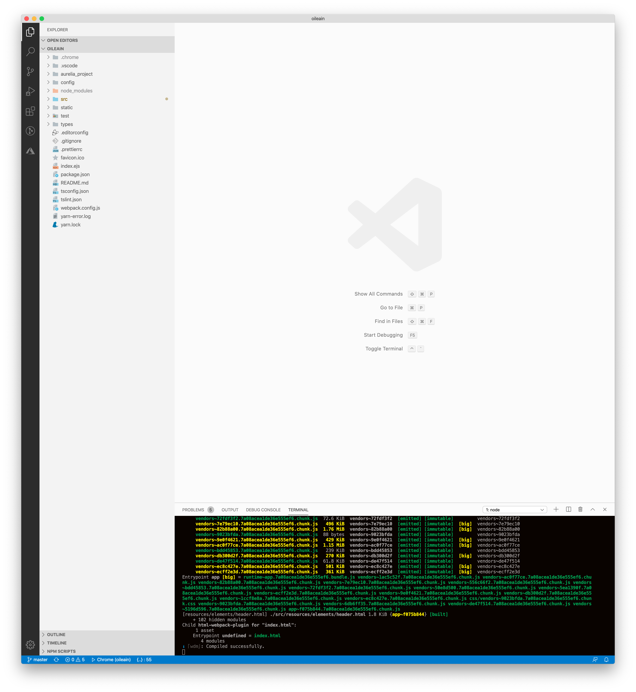
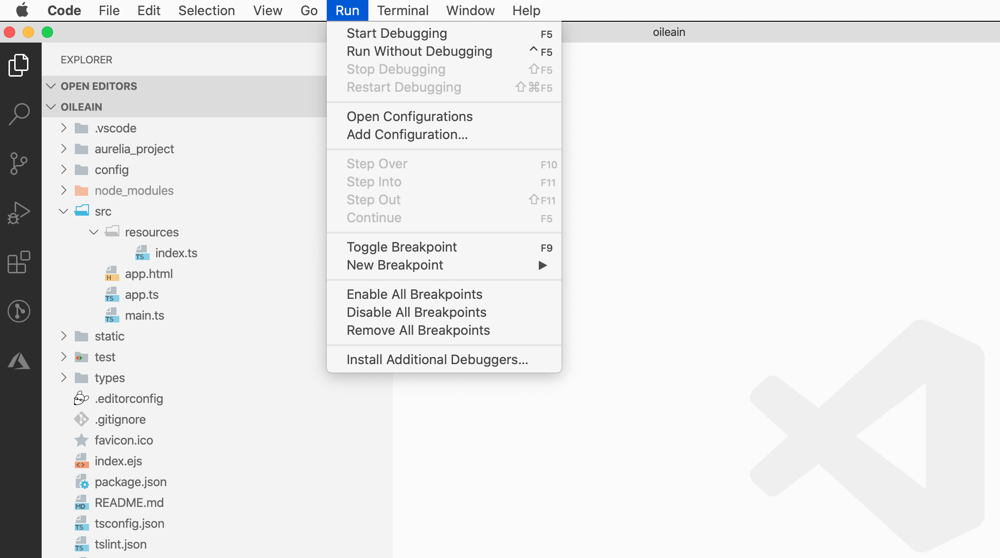
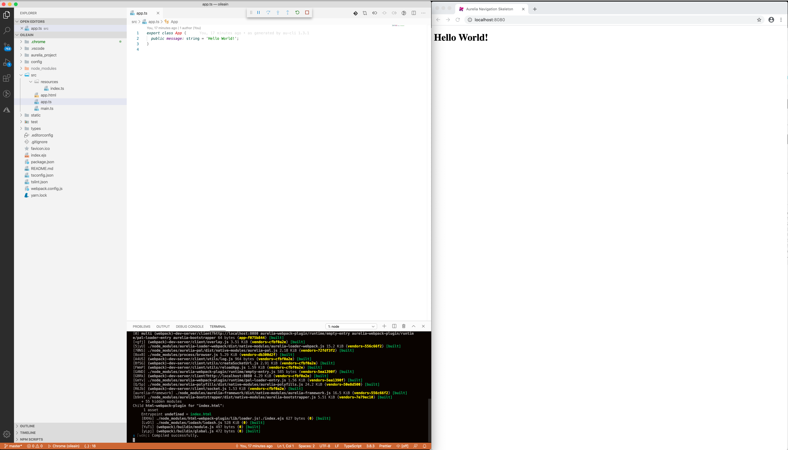
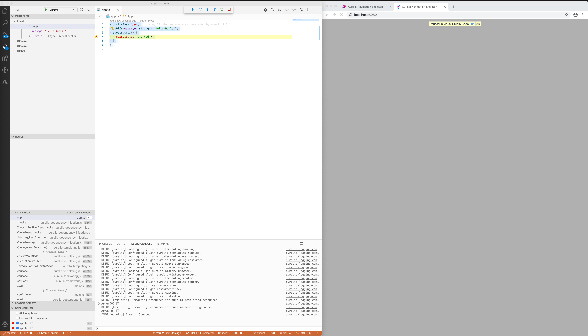

# Create Project + Debug in VSCode

This is the final version of the application we will build:

- <https://oileain.netlify.app/>

Explore the various features of the UX, including the side bar and the secondary views:

- <https://oileain.netlify.app/navigator>
- <https://oileain.netlify.app/poi/Great-Saltee-Island>

## Starter Application

Make sure to have a recent node installation, and also the Aurelia CLI installed:

~~~bash
npm install aurelia-cli -g
~~~

Create a new application:

~~~bash
au new oileain
~~~

Be sure to select `Typescript` and `Yarn` in the options menu.

Experiment instead with VSCode as an alternative to WebStorm:

- <https://code.visualstudio.com/>

Open in project folder in VSCode, run the terminal from VSCode, and enter:

~~~
au run --watch
~~~

VSCode will automatically support launch/debug via chrome:

This should launch a chrome instance - and you will be able to debug/step in VSCode the app:

Try out setting a breakpoint - first extend the App class with some additional code:

## src/app.ts

~~~typescript
export class App {
  public message: string = "Hello World!";
  constructor() {
    console.log("started");
  }
}
~~~

Drop a breakpoint in the constructor - and see if you can break and inspect:

The configuration for this feature is added to our project - best to exclude from git:

## .gitignore

~~~
...
.chrome
~~~