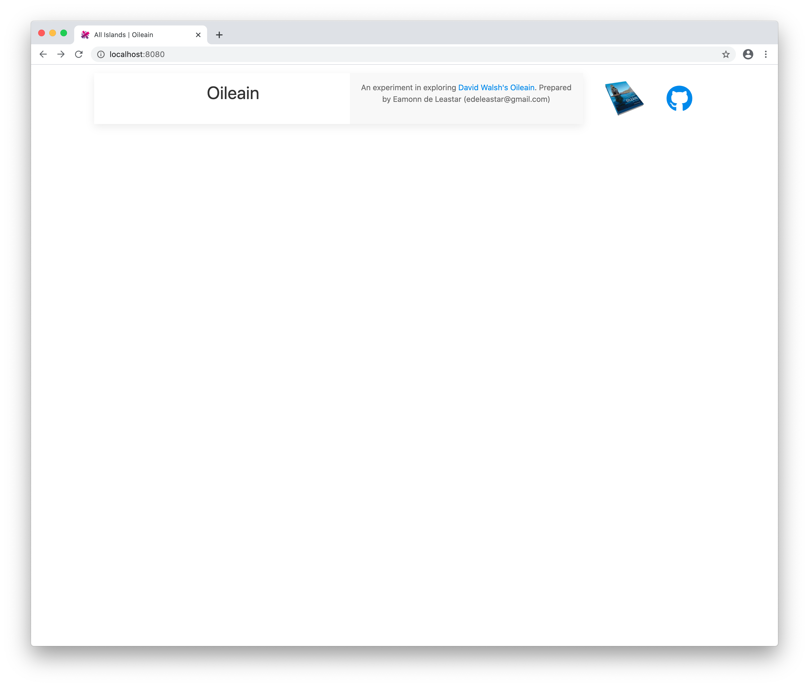
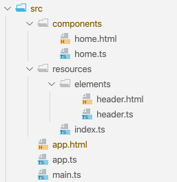

# Home page

We would like start with a simple header on a blank page:

This will be the project source structure in this step:

Create this view in the `src` folder:

## resources/elements/header.html

~~~html
<template>
  

    

      

        

          <h2> ${title} </h2>
        

      

      

        

          
 An experiment in exploring <a href="http://www.oileain.org/">David Walsh's
              Oileain</a>.
            Prepared by Eamonn de Leastar (edeleastar@gmail.com)

          

        

      

    

    
    <a href="https://github.com/edeleastar/oileain-au" title="Project Source" pos="bottom" uk-tooltip>
      <font-awesome-icon icon.bind="github" size="3x"></font-awesome-icon>
    </a>
  

</template>
~~~

... and this associated ViewModel:

## resource/elements/header.ts

~~~typescript
import { bindable } from "aurelia-framework";
import { faGithub } from "@fortawesome/free-brands-svg-icons";;

export class Header {
  @bindable title: string;
  github = faGithub;
}
~~~

Create a new component for the home page:

## components/home.html

~~~html
<template>
</template>
~~~

## components/home.ts

~~~typescript
export class Home {
}
~~~

Finally, the main application includes this header + a standard router:

## app.html

~~~html
<template>
  <require from="./resources/elements/header"></require>
  <header title.one-way="title"></header>
  

    <router-view></router-view>
  

</template>
~~~

.. here we configure the router:

## app.ts

~~~typescript
import { PLATFORM } from "aurelia-pal";
import { Router, RouterConfiguration } from "aurelia-router";

export class App {
  title = "Oileain";
  constructor() {}

  configureRouter(config: RouterConfiguration, router: Router) {
    config.title = "Oileain";
    config.map([
      {
        route: [""],
        moduleId: PLATFORM.moduleName("./components/home"),
        title: "All Islands",
      }
    ]);
  }
}
~~~

The app should stand up now:

