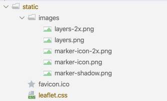

# First Map Component

This is how we would like the home page to look at the end of this step:

We will use the Leaflet map component:

- <https://leafletjs.com/>

Add the component to our project:

~~~
yarn add leaflet
~~~

We also need these static assets:

- [static.zip](archives/static.zip)

Download and unzip into the static folder in our project:

We will include this style sheet for all pages via the index.ejs in the project root:

## index.ejs

~~~html
  ...
    <link rel="stylesheet" href="/leaflet.css">
  ...
~~~

## Services

These classes below wrappers around the Leaflet classes - to encapsulate and simplify map creation and configuration:

A Point of Interest of interfaces (just location for the moment):

## services/poi.ts

~~~typescript
export interface Geodetic {
  lat: number;
  long: number;
}
~~~

Then a Map abstraction:

## services/leaflet-map.ts

~~~typescript
import * as L from "leaflet";
import Map = L.Map;
import LayersObject = L.Control.LayersObject;
import { Geodetic } from "./poi";
import LayerControl = L.Control.Layers;

export interface LeafletMapDescriptor {
  id: string;
  height: number;
  location: Geodetic;
  zoom: number;
  minZoom: number;
  activeLayer: string;
}

export class LeafletMap {
  imap: Map;
  control: LayerControl;
  overlays: LayersObject = {};

  baseLayers = {
    Terrain: L.tileLayer("https://{s}.tile.openstreetmap.org/{z}/{x}/{y}.png", {
      maxZoom: 17,
      attribution:
        'Map data: &copy; <a href="https://www.openstreetmap.org/copyright">OpenStreetMap</a> contributors, <a href="http://viewfinderpanoramas.org">SRTM</a> | Map style: &copy; <a href="https://opentopomap.org">OpenTopoMap</a> (<a href="https://creativecommons.org/licenses/by-sa/3.0/">CC-BY-SA</a>)',
    }),
    Satellite: L.tileLayer(
      "https://server.arcgisonline.com/ArcGIS/rest/services/World_Imagery/MapServer/tile/{z}/{y}/{x}",
      {
        attribution:
          "Tiles &copy; Esri &mdash; Source: Esri, i-cubed, USDA, USGS, AEX, GeoEye, Getmapping, Aerogrid, IGN, IGP, UPR-EGP, and the GIS User Community",
      }
    ),
  };

  constructor(descriptor: LeafletMapDescriptor) {
    let defaultLayer = this.baseLayers.Terrain;
    if (descriptor.activeLayer) {
      defaultLayer = this.baseLayers[descriptor.activeLayer];
    }
    this.imap = L.map(descriptor.id, {
      center: [descriptor.location.lat, descriptor.location.long],
      zoom: descriptor.zoom,
      minZoom: descriptor.minZoom,
      layers: [defaultLayer],
    });
    this.addControl();
  }

  addControl() {
    this.control = L.control
      .layers(this.baseLayers, this.overlays)
      .addTo(this.imap);
  }
}
~~~

## Components

On our home page we insert a placeholder `
`

## components/home.html

~~~html
<template>
  

</template>
~~~

In the ViewModel, we establish the maps characteristics + create the map object:

## components/home.ts

~~~typescript
import { LeafletMap } from "services/leaflet-map";

export class Home {

  mapDescriptor = {
    id: "home-map-id",
    height: 1200,
    location: { lat: 53.2734, long: -7.7783203 },
    zoom: 8,
    minZoom: 7,
    activeLayer: "",
  };

  map: LeafletMap;

  attached() {
    this.map = new LeafletMap(this.mapDescriptor);
  }
}
~~~

This should now display :

The API we are encapsulating with our LeafletMap class are documented here:

- <https://leafletjs.com/reference-1.6.0.html>

This is a peek inside its object structure:

- <https://leafletjs.com/examples/extending/class-diagram.html>

We will try to hide as much of this complexity inside a few wrapper classes.