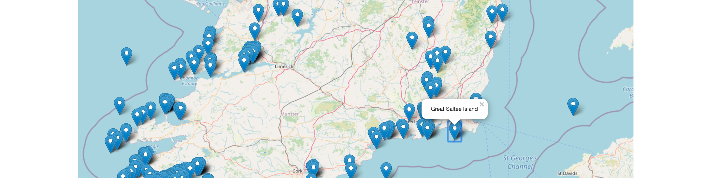

# Marker Popups

Clicking on a marker should show a popup with the Island name:

This is implemented with a small change to the populateCoast method:

## services/costal-map.ts

~~~typescript
  populateCoast(coast: Coast, link: boolean = true) {
    let group = L.layerGroup([]);
    coast.pois.forEach((poi) => {
      let marker = L.marker([poi.coordinates.geo.lat, poi.coordinates.geo.long]);
      var newpopup = L.popup({ autoClose: false, closeOnClick: false });
      newpopup.setContent(poi.name);
      marker.bindPopup(newpopup);
      marker.addTo(group);
    });
    this.addLayer(coast.title, group);
    this.control.addOverlay(group, coast.title);
  }
~~~