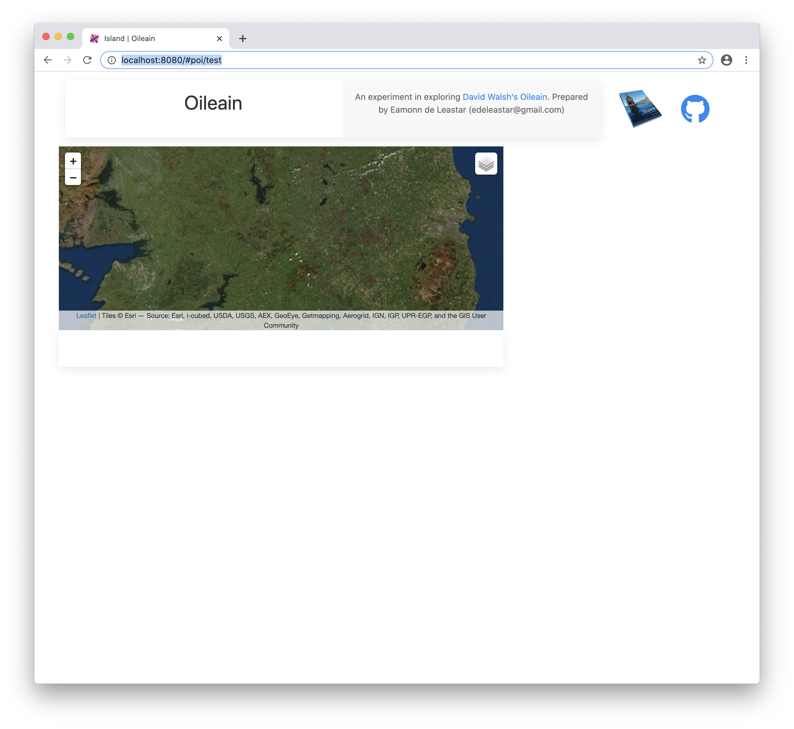

# POIDetail Skeleton

Application so far:

- <https://github.com/edeleastar/oileain-lab/releases/tag/lab-1.end>

## POI Detail

This is a new view we would like to develop:

It will show a map + details for a specific island. We will piece it together over the next few steps.

Here is a skeleton of the new view component:

## components/poi-detail.html

~~~html
<template>
  

    

      

      

      

    

    

    

  

</template>
~~~

(We are leaving placeholders for additional elements in the above)

This is the matching ViewModel:

## components/poi-detail.ts

~~~typescript
import { LeafletMap } from "../services/leaflet-map";
import { Oileain } from "../services/oileain";

@autoinject
export class PoiDetail {
  title = "Olieain POI View";

  mapDescriptor = {
    id: "poi-map-id",
    height: 300,
    location: { lat: 53.2734, long: -7.7783203 },
    zoom: 8,
    minZoom: 7,
    activeLayer: "Satellite",
  };
  map: LeafletMap;

  constructor(private oileain: Oileain) {}

  async activate(params: any) {
  }

  attached() {
    this.map = new LeafletMap(this.mapDescriptor);
  }
}
~~~

To establish the component as a route, extend the application router:

## app.ts

~~~typescript
      {
        route: "poi/:id",
        moduleId: PLATFORM.moduleName("./components/poi-detail"),
        name: "pois",
        title: "Island",
      },
~~~

Restarting the app now (when a router is modifier you often need to restart Aurelia applications) - then this route will now be active:

- <http://localhost:8080/#poi/test>

The new route is in two parts `poi`, which is constant, and `test` - which can be any string. This is specified in the route definition above:

~~~typescript
        route: "poi/:id",
~~~

Try the route now and you should see this:

With single page applications, we sometime like to remove the `#` from the segment to make the url appear more natural. This possible via a browsers session features:

- <https://developer.mozilla.org/en-US/docs/Web/API/History_API>

Aurelia support this seamlessly. It needs to be explicitly enabled via `pushState` configuration:

## app.ts 

~~~typescript
...
  configureRouter(config: RouterConfiguration, router: Router) {
    config.title = "Oileain";
    config.options.pushState = true;
 ...   
~~~

With this enabled, our URL is free of `#` characters:

- <http://localhost:8080/poi/test>