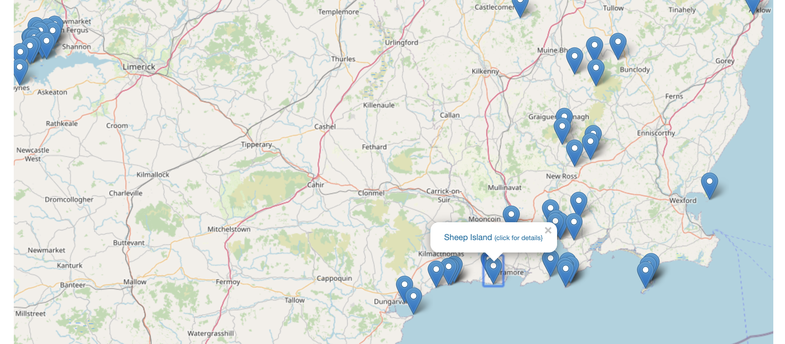
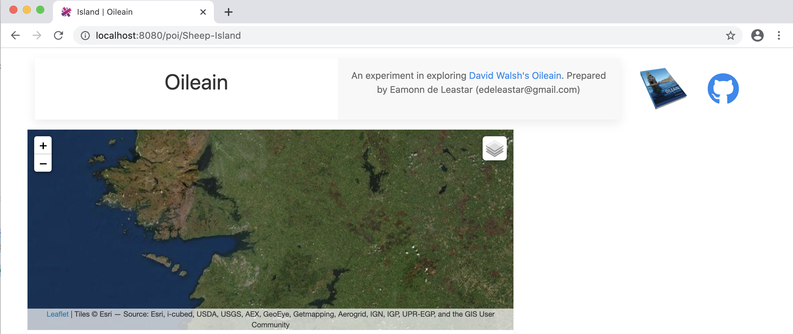

# Triggering Routes

If we place a link on each marker popop - 

Then clicking this link should trigger our new view:

Notice the url in the above:

- <http://localhost:8080/poi/Sheep-island>

We already have the router configured to support this route - so a small change to the way we create the popup will do the trick:

## services/costal-leaflet-map.ts

~~~typescript
  populateCoast(coast: Coast, link: boolean = true) {
    let group = L.layerGroup([]);
    coast.pois.forEach((poi) => {
      let marker = L.marker([poi.coordinates.geo.lat, poi.coordinates.geo.long]);
      var newpopup = L.popup({ autoClose: false, closeOnClick: false });
      const popupTitle = link
      ? `<a href='/poi/${poi.safeName}'>${poi.name} <small>(click for details}</small></a>`
      : poi.name;
      newpopup.setContent(popupTitle);
      marker.bindPopup(newpopup);
      marker.addTo(group);
    });
    this.addLayer(coast.title, group);
    this.control.addOverlay(group, coast.title);
  }
~~~

If a link is requested, then our link is simple to construct:

- `<a href='/poi/${poi.safeName}'>${poi.name} <small>(click for details}</small></a>`

We are using the `safeName` from each island as its id.