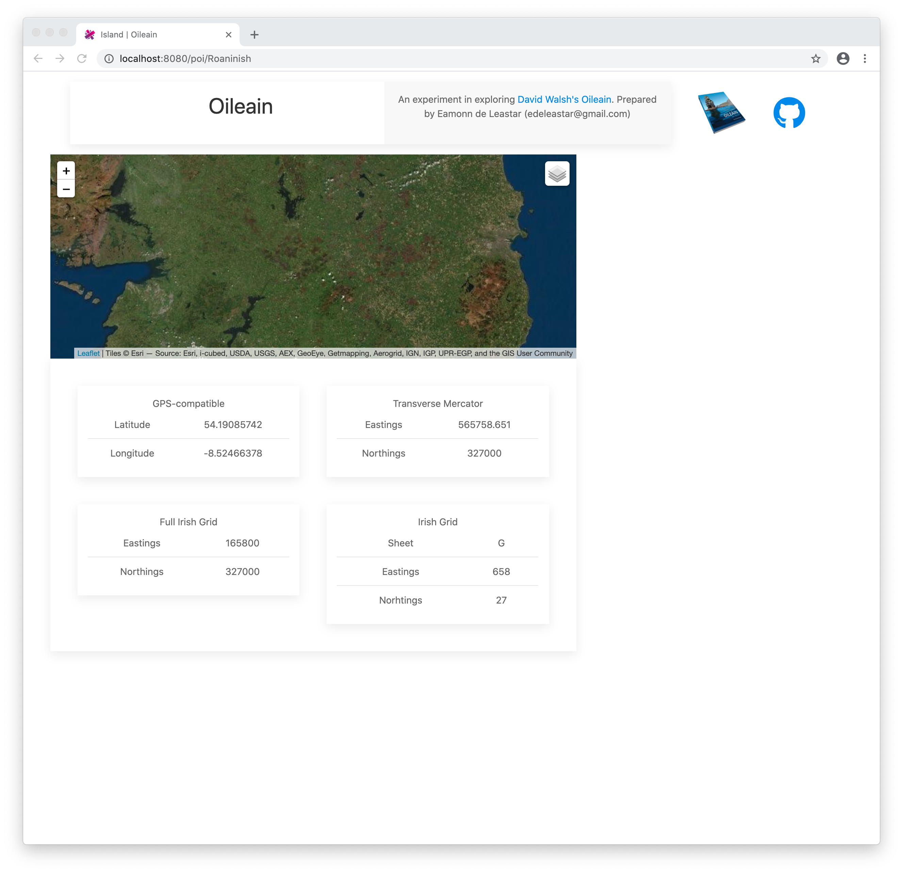

# POI Location Detail

Currently we are not rendering an island data in the poi-detail component. In this step we will display a panel showing the location of the selected island:

First we need to cache indexes of the map data in the Oileain service:

## services/oileain.ts

~~~typescript
import { autoinject } from "aurelia-framework";
import { Coast, PointOfInterest, Region } from "./poi";
import { HttpClient } from "aurelia-fetch-client";

@autoinject
export class Oileain {
  coasts: any[];
  islandMap = new Map<string, PointOfInterest>();
  coastMap = new Map<string, Coast>();

  constructor(private http: HttpClient) {}

  async getCoasts() {
    if (!this.coasts) {
      const response = await this.http.fetch("https://edeleastar.github.io/oileain-api/all-slim.json");
      this.coasts = await response.json();
      this.createIndexes();
    }
    return this.coasts;
  }

  async getIslandById(id: string) {
    return await this.getIsland(this.islandMap.get(id));
  }

  async getIsland(poi: PointOfInterest) {
    let cachedPoi = this.islandMap.get(poi.safeName);
    if (cachedPoi.description) {
      return cachedPoi;
    } else {
      const path = `https://edeleastar.github.io/oileain-api/${poi.coast.variable}/${poi.safeName}.json`;
      const response = await this.http.fetch(path);
      const island = await response.json();
      this.islandMap.set(poi.safeName, island);
      return island;
    }
  }

  createIndexes() {
    this.coasts.forEach((coast) => {
      this.coastMap.set(coast.variable, coast);
      coast.pois.forEach((poi) => {
        poi.coast = coast;
        this.islandMap.set(poi.safeName, poi);
      });
    });
  }
}
~~~

In the above, we create 2 maps:

~~~typescript
  islandMap = new Map<string, PointOfInterest>();
  coastMap = new Map<string, Coast>();
~~~

This islandMap is indexed on island id (safeName), so we can use it to retrieve island details in the poi-detail component.

Modify poi-detail ViewModel to retrieve the poi based on the path used to activate the component, and store a reference to the poi as a class field:

## components/poi-details.ts

~~~typescript
  ...
  poi: PointOfInterest;
  ...
  renderPoi(poi) {
    this.poi = poi;
    this.title = poi.name;
  }

  async activate(params) {
    await this.oileain.getCoasts();
    const poi = await this.oileain.getIslandById(params.id);
    this.renderPoi(poi);
  }
  ...
~~~

We can then define a new html component to display location details for a poi:

## resources/elements/poi-coordinates.html

~~~html
<template bindable="poi">
  

    

      

        <caption>GPS-compatible</caption>
        <table class="uk-table uk-table-divider uk-table-small">
          <tbody>
            <tr>
              <td>Latitude</td>
              <td>${poi.coordinates.geo.lat}</td>
            </tr>
            <tr>
              <td>Longitude</td>
              <td>${poi.coordinates.geo.long}</td>
            </tr>
          </tbody>
        </table>
      

    

    

      

        <caption>Transverse Mercator</caption>
        <table class="uk-table uk-table-divider uk-table-small">
          <tbody>
            <tr>
              <td>Eastings</td>
              <td>${poi.coordinates.tmcGrid.eastings}</td>
            </tr>
            <tr>
              <td>Northings</td>
              <td>${poi.coordinates.fullIrishGrid.northings}</td>
            </tr>
          </tbody>
        </table>
      

    

  

  

    

      

        <caption>Full Irish Grid</caption>
        <table class="uk-table uk-table-divider uk-table-small">
          <tbody>
            <tr>
              <td>Eastings</td>
              <td>${poi.coordinates.fullIrishGrid.eastings}</td>
            </tr>
            <tr>
              <td>Northings</td>
              <td>${poi.coordinates.fullIrishGrid.northings}</td>
            </tr>
          </tbody>
        </table>
      

    

    

      

        <caption>Irish Grid</caption>
        <table class="uk-table uk-table-divider uk-table-small">
          <tbody>
            <tr>
              <td>Sheet</td>
              <td>${poi.coordinates.irishGrid.sheet}</td>
            </tr>
            <tr>
              <td>Eastings</td>
              <td>${poi.coordinates.irishGrid.eastings}</td>
            </tr>
            <tr>
              <td>Norhtings</td>
              <td>${poi.coordinates.irishGrid.northings}</td>
            </tr>
          </tbody>
        </table>
      

    

  

</template>
~~~

The poi-detail view can then just include this component:

## components/poi-detail.html

~~~html
<template>
  <require from="../resources/elements/poi-coordinates.html"></require>

  

    

      

      

        <poi-coordinates poi.one-way="poi"></poi-coordinates>
      

    

    

    

  

</template>
~~~

This should display now:

Try other islands from the main map to see that they work.

Notice this is a 'html only' component - it has no associated ViewModel. This means we include the component by including `.html` in the path:

~~~html
  <require from="../resources/elements/poi-coordinates.html"></require>
~~~

... and we also ensure that the poi is 'bound' in the template with this declaration:

~~~html
<template bindable="poi">
~~~