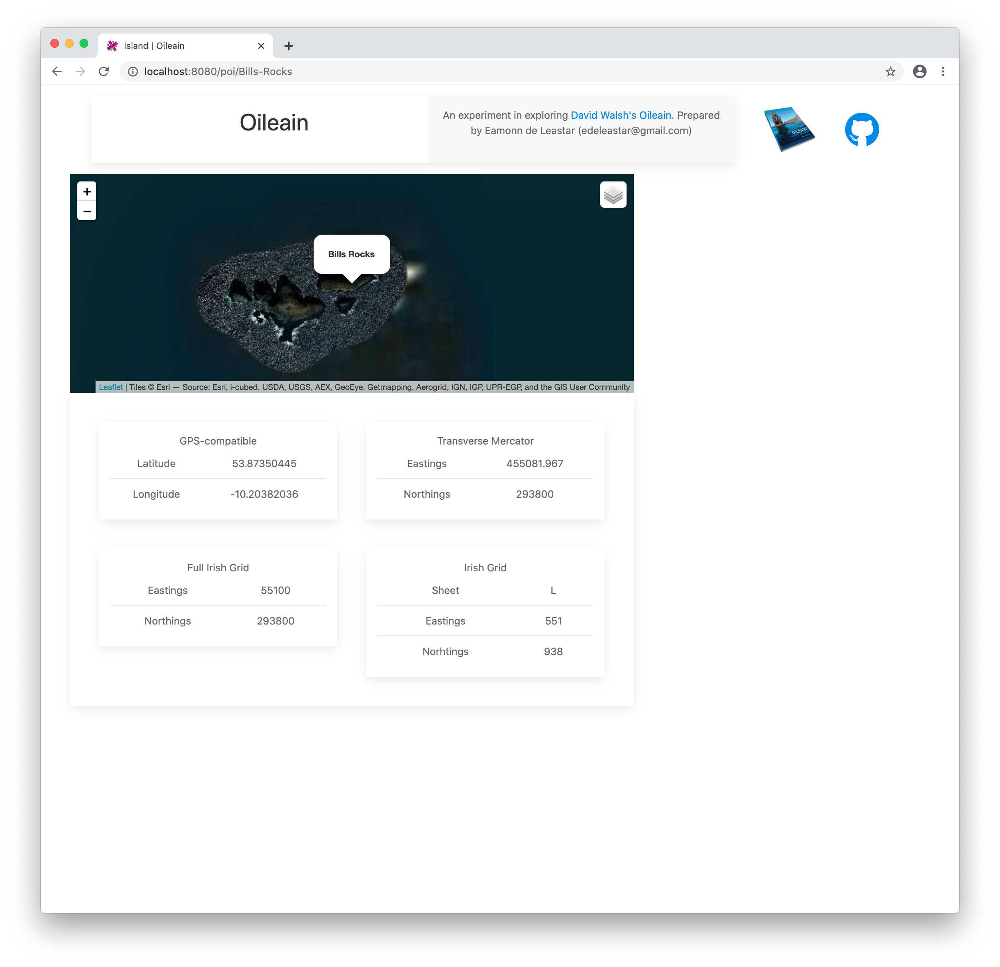

# Island Zoom to 

When the poi-detial component appears - we would like the map to zoom to the island selected:

The LeafletMap component will need additional features to support this:

## services/leaflet-map.ts

~~~typescript
...
import LayerGroup = L.LayerGroup;
...

export class LeafletMap { 
  ...

  moveTo(zoom: number, location: Geodetic) {
    this.imap.setZoom(zoom);
    this.imap.panTo(new L.LatLng(location.lat, location.long));
  }

  zoomTo(location: Geodetic) {
    this.imap.setView(new L.LatLng(location.lat, location.long), 8);
  }

  addPopup(layerTitle: string, content: string, location: Geodetic) {
    let popupGroup: LayerGroup;
    if (!this.overlays[layerTitle]) {
      popupGroup = L.layerGroup([]);
      this.overlays[layerTitle] = popupGroup;
      this.imap.addLayer(popupGroup);
    } else {
      popupGroup = this.overlays[layerTitle] as LayerGroup;
    }
    const popup = L.popup({
      closeOnClick: false,
      closeButton: false,
    })
      .setLatLng({ lat: location.lat, lng: location.long })
      .setContent(content);
    popup.addTo(popupGroup);
  }

  invalidateSize() {
    this.imap.invalidateSize();
    let hiddenMethodMap = this.imap as any;
    hiddenMethodMap._onResize();
  }
~~~

Then in the poi-detail component, we can make use of these features:

## components/poi-detail.ts

~~~typescript
  renderPoi(poi) {
    this.poi = poi;
    this.title = poi.name;
    if (this.map) {
      this.map.addPopup("Islands", poi.nameHtml, poi.coordinates.geo);
      this.map.moveTo(15, poi.coordinates.geo);
      this.map.invalidateSize();
    }
  }

  ...

  attached() {
    this.map = new LeafletMap(this.mapDescriptor);
    if (this.poi) {
      this.renderPoi(this.poi);
    }
  }
~~~

The map should now activate zooming to the island selected:

