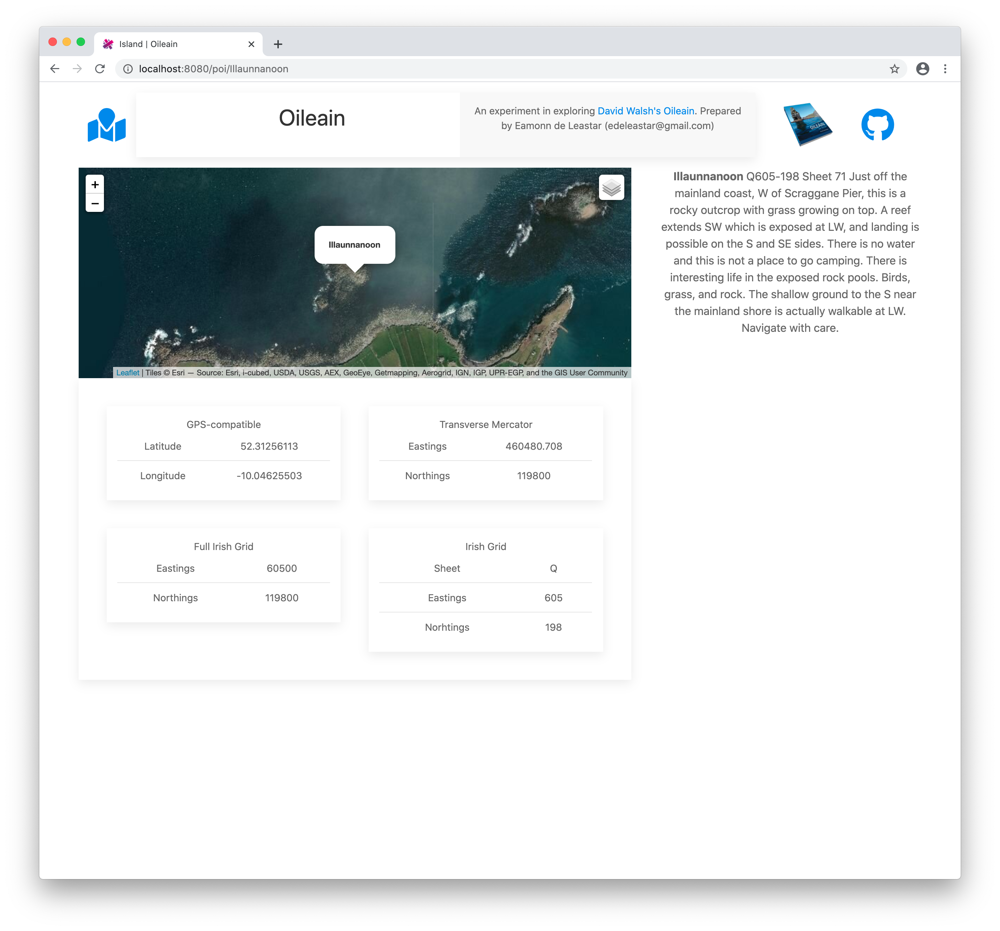
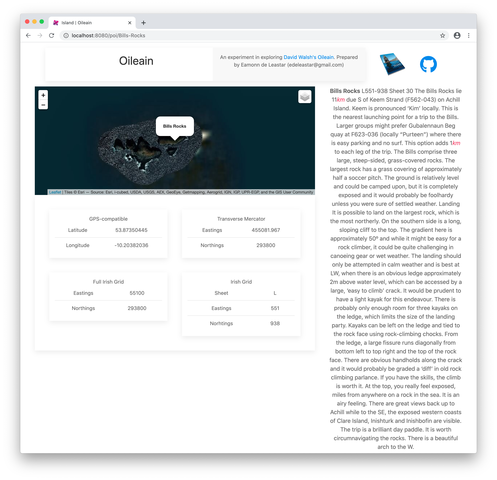
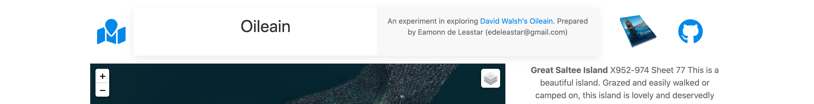

# Poi Description

We should also display island description in another panel on the right:

This is another html-only component:

## resources/elements/poi-description.html

~~~html
<template bindable="poi">
  

    

      
 ${poi.description}

    

  

</template>
~~~

The text is in html - so we use 'innerhtml.bind' to ensure the formatting is applied.

We can just include it, and the panel should appear:

## components/poi-detail.html

~~~html
<template>
  <require from="../resources/elements/poi-coordinates.html"></require>
  <require from="../resources/elements/poi-description.html"></require>

  

    

      

      

        <poi-coordinates poi.one-way="poi"></poi-coordinates>
      

    

    

      <poi-description poi.one-way="poi"></poi-description>
    

  

</template>
~~~

We should extend the header to include additional navigation icons. First, import a map icon in the header ViewModel:

## resources/elements/header.ts

~~~typescript

import { bindable } from "aurelia-framework";
import { faGithub } from "@fortawesome/free-brands-svg-icons";;
import { faMapMarked } from "@fortawesome/free-solid-svg-icons";

export class Header {
  @bindable title: string;
  github = faGithub;
  map = faMapMarked;
}
~~~

Then we can include a new link in the header:
## resources/elements/header.html

~~~html
  ...
    

      <a href="/" title="Islands of Ireland" pos="bottom" uk-tooltip>
        <font-awesome-icon icon.bind="map" size="3x"></font-awesome-icon>
      </a>
    

  ...
~~~

This new icon should take us back to the home page:

