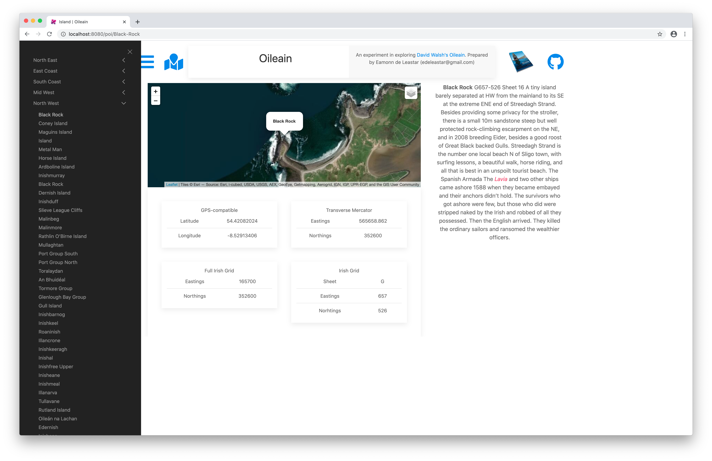

# Islands Side Panel

The slide out side panel provides direct access to any island, organised by coast:

We already have the route in place - so all need is a UIKit offcanvas control:

- <https://getuikit.com/docs/offcanvas>

Here is a new element to render this view:

## resources/elements/coasts-sidebar.html

~~~html
<template>
  

    

    <button class="uk-offcanvas-close" type="button" uk-close></button>
      

        <ul class="uk-nav-default uk-nav-parent-icon" uk-nav>
          <li class="uk-parent">
            <a href="#">${coast.title}</a>
            <ul class="uk-nav-sub">
              

                <li><a href="/poi/${poi.safeName}"> ${poi.name}</a></a></li>
              

            </ul>
          </li>
        </ul>
      

    

  

</template>
~~~

This is the matching ViewModel:

## resources/elements/coasts.sidebar.ts

~~~typescript
import { Oileain } from "../../services/oileain";
import { autoinject } from "aurelia-framework";
import { Coast } from "../../services/poi";

@autoinject
export class CoastsSidebar {
  coasts: Array<Coast>;

  constructor(private oileain: Oileain) {
    this.loadCoasts();
  }

  async loadCoasts() {
    this.coasts = await this.oileain.getCoasts();
  }
}
~~~

We need a new icon in the header to trigger the off-canvas control: 

## resources/elements/header.html

~~~html
  ...
    

      <a href="#coasts-menu" uk-toggle title="Clickable list all Islands by Costal Region" pos="bottom" uk-tooltip>
        <font-awesome-icon icon.bind="bars" size="3x"></font-awesome-icon>
      </a>
    
 
    ...
~~~

This requires the bars icon:

## resources/elements/header.ts

~~~typescript
import { bindable } from "aurelia-framework";
import { faGithub } from "@fortawesome/free-brands-svg-icons";;
import { faBars, faMapMarked } from "@fortawesome/free-solid-svg-icons";

export class Header {
  @bindable title: string;
  github = faGithub;
  map = faMapMarked;
  bars = faBars;
}
~~~

Finally, this component is included in app.html:

## app.html

~~~html
<template>
  <require from="./resources/elements/header"></require>
  <require from="./resources/elements/coasts-sidebar"></require>
  <header title.one-way="title"></header>
  <coasts-sidebar></coasts-sidebar>
  

    <router-view></router-view>
  

</template>
~~~

Try this now, and we should have a navigable list of all islands which will trigger the poi-detail view:

