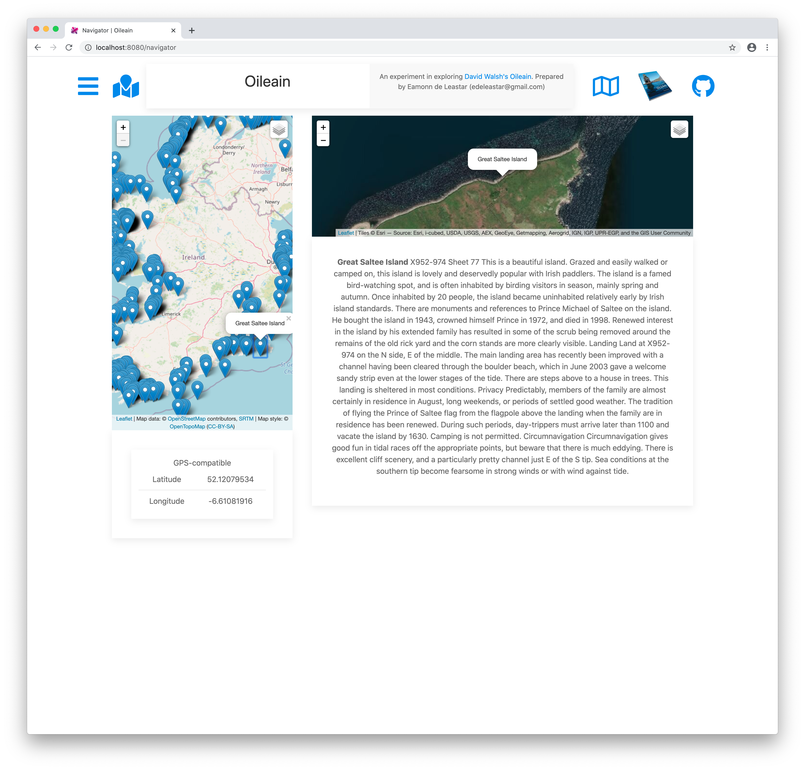
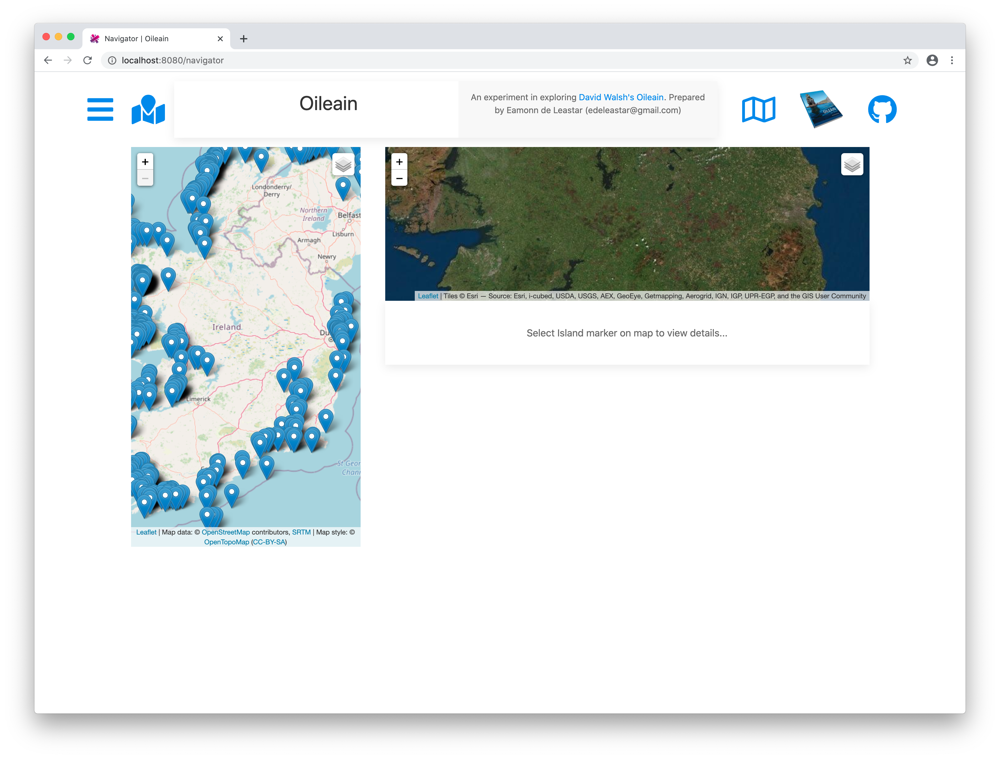

# Navigator Component

Our final view will be a new component to show and all Ireland map + an accompanying map to show a selected island:

This is a first version of this new component:

## components/navigator.html

~~~html
<template>
  <require from="../resources/elements/poi-lat-lng.html"></require>
  <require from="../resources/elements/poi-description.html"></require>

  

    

      

      

        

          <poi-lat-lng poi.one-way="poi"></poi-lat-lng>
        

      

    

    

      

      

        

          <poi-description poi.one-way="poi"></poi-description>
        

      

      

        

          
 Select Island marker on map to view details...
        

      

    

  

</template>
~~~

The above uses two html components:

- poi-description.html
- poi-lat-lng.html

The first is already defined in our project, the second is new:

## resources/elements/poi-lat-lng.html

~~~html
<template bindable="poi">
  

    <caption>GPS-compatible</caption>
    <table class="uk-table uk-table-divider uk-table-small">
      <tbody>
        <tr>
          <td>Latitude</td>
          <td>${poi.coordinates.geo.lat}</td>
        </tr>
        <tr>
          <td>Longitude</td>
          <td>${poi.coordinates.geo.long}</td>
        </tr>
      </tbody>
    </table>
  

  

</template>
~~~

The ViewModel for the Navigator:

## components/navigator.ts

~~~typescript
import { LeafletMap } from "../services/leaflet-map";
import { Coast } from "../services/poi";
import { autoinject } from "aurelia-framework";
import { Oileain } from "../services/oileain";
import { CoastalLeafletMap } from "../services/coastal-leaflet-map";

@autoinject
export class Navigator {
  mainMapDescriptor = {
    id: "home-map-id",
    height: 650,
    location: { lat: 53.2734, long: -7.7783203 },
    zoom: 7,
    minZoom: 7,
    activeLayer: "",
  };

  islandMapDescriptor = {
    id: "island-map-id",
    height: 250,
    location: { lat: 53.2734, long: -7.7783203 },
    zoom: 8,
    minZoom: 7,
    activeLayer: "Satellite",
  };

  mainMap: CoastalLeafletMap;
  islandMap: LeafletMap;
  coasts: Array<Coast>;

  constructor(private oileain: Oileain) {}

  async activate(params) {
    this.coasts = await this.oileain.getCoasts();
  }

  attached() {
    this.mainMap = new CoastalLeafletMap(this.mainMapDescriptor);
    this.islandMap = new LeafletMap(this.islandMapDescriptor);
    this.mainMap.populateCoasts(this.coasts, false);
  }
}
~~~

This is a new component, so it requires an additional route:

## app.ts

~~~typescript
  ...
      {
        route: "navigator",
        moduleId: PLATFORM.moduleName("./components/navigator"),
        name: "navigator",
        title: "Navigator",
      },
  ...
~~~

To trigger this component, we need a new icon in the header:

## resources/element/header.html

~~~html
...
    <a href="/navigator" title="Navigator View" pos="bottom" uk-tooltip>
      <font-awesome-icon icon.bind="mapAlt" size="3x"> </font-awesome-icon> </i>
    </a>
...
~~~

This requires an additional icon:

~~~typescript
import { faMap } from "@fortawesome/free-regular-svg-icons";

...
  mapAlt = faMap;
...
~~~

Our Navigator component should be available now (using the alternative map icon in the header):

Clicking on icons does not yet trigger any behaviour in the second map panel.