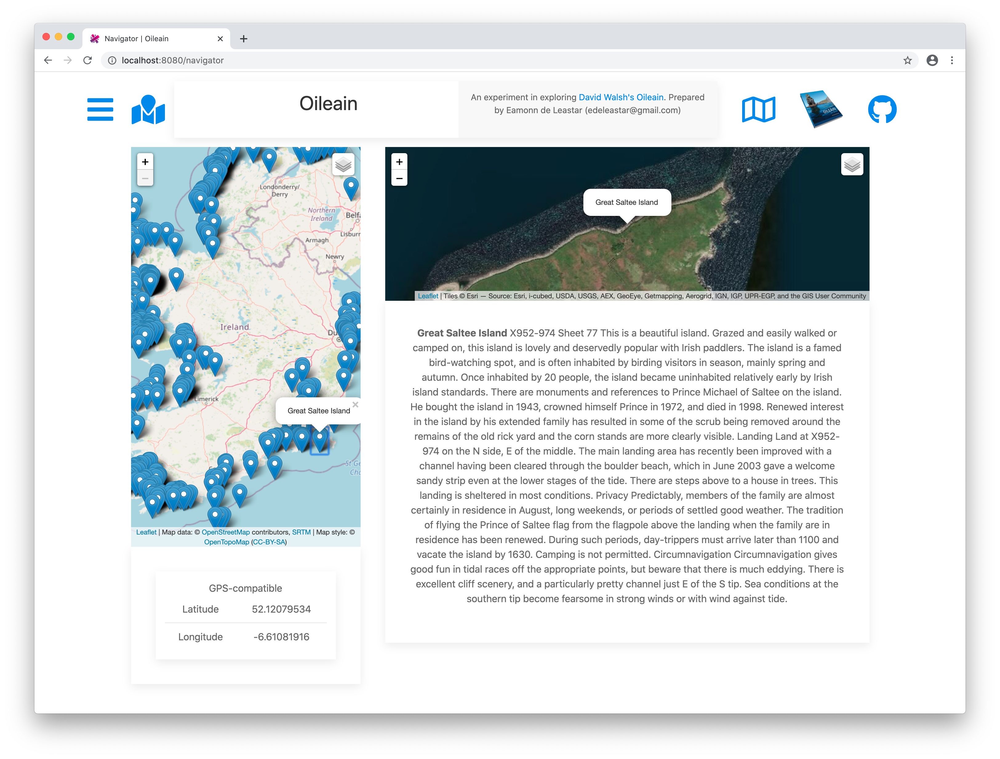

# Marker Events

If a marker is selected in the main map, we would like the map + details on the right to be updated:

This requires hooking up to the marker events supported by Leaflet. Here a revised CoastLeaflet map class:

## services/coastal-leaflet.ts

~~~typescript
import { LeafletMap, LeafletMapDescriptor } from "./leaflet-map";
import { Coast, PointOfInterest } from "./poi";
import * as L from "leaflet";
import Marker = L.Marker;

export interface PoiSelect {
  onSelect(id: string): any;
}

export class CoastalLeafletMap extends LeafletMap {

  markerMap = new Map<Marker, PointOfInterest>();
  constructor(descriptor: LeafletMapDescriptor) {
    super(descriptor);
  }

  populateCoast(coast: Coast, link: boolean = true, poiSelect: PoiSelect = null) {
    let group = L.layerGroup([]);
    coast.pois.forEach((poi) => {
      let marker = L.marker([poi.coordinates.geo.lat, poi.coordinates.geo.long]);
      var newpopup = L.popup({ autoClose: false, closeOnClick: false });
      const popupTitle = link
      ? `<a href='/poi/${poi.safeName}'>${poi.name} <small>(click for details}</small></a>`
      : poi.name;
      newpopup.setContent(popupTitle);
      marker.bindPopup(newpopup);
      marker.addTo(group);
      if (poiSelect) {
        this.markerMap.set(marker, poi);
        marker.addTo(group).on("popupopen", (event) => {
          const marker = event.popup._source;
          const shortPoi = this.markerMap.get(marker);
          poiSelect.onSelect(shortPoi.safeName);
        });
      }
    });
    this.addLayer(coast.title, group);
    this.control.addOverlay(group, coast.title);
  }

  populateCoasts(coasts: Array<Coast>, link: boolean = true,  poiSelect: PoiSelect = null) {
    if (this.imap) {
      coasts.forEach((coast) => {
        this.populateCoast(coast, link, poiSelect);
      });
      this.imap.invalidateSize();
    }
  }
}
~~~

This defines a new `PoiSelect` interface:

~~~typescript
export interface PoiSelect {
  onSelect(id: string): any;
}
~~~

Rework the Navigator component to implement this interface, and to register itself as a listener when adding markers:

## components/navigator.ts

~~~typescript
import { LeafletMap } from "../services/leaflet-map";
import { Coast, PointOfInterest } from "../services/poi";
import { autoinject } from "aurelia-framework";
import { Oileain } from "../services/oileain";
import { CoastalLeafletMap, PoiSelect } from "../services/coastal-leaflet-map";

@autoinject
export class Navigator implements PoiSelect {
  mainMapDescriptor = {
    id: "home-map-id",
    height: 650,
    location: { lat: 53.2734, long: -7.7783203 },
    zoom: 7,
    minZoom: 7,
    activeLayer: "",
  };

  islandMapDescriptor = {
    id: "island-map-id",
    height: 250,
    location: { lat: 53.2734, long: -7.7783203 },
    zoom: 8,
    minZoom: 7,
    activeLayer: "Satellite",
  };

  mainMap: CoastalLeafletMap;
  islandMap: LeafletMap;
  coasts: Array<Coast>;
  poi: PointOfInterest;
  poiSelected = false;

  constructor(private oileain: Oileain) {}

  async activate(params) {
    this.coasts = await this.oileain.getCoasts();
  }

  attached() {
    this.mainMap = new CoastalLeafletMap(this.mainMapDescriptor);
    this.islandMap = new LeafletMap(this.islandMapDescriptor);
    this.mainMap.populateCoasts(this.coasts, false, this);
  }

  async onSelect(id: string) {
    this.poi = await this.oileain.getIslandById(id);
    if (this.islandMap) {
      this.islandMap.addPopup("Islands", this.poi.name, this.poi.coordinates.geo);
      this.islandMap.moveTo(15, this.poi.coordinates.geo);
      this.islandMap.invalidateSize();
      this.poiSelected = true;
    }
  }
}
~~~

The `onSelect` method above will be triggered when a marker is selected, which should update the Map + panel:

